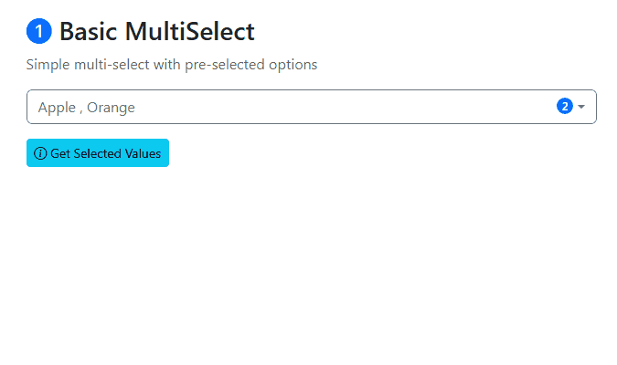

# Bootstrap MultiSelect

[](https://www.nuget.org/packages/BootstrapMultiSelect.MVC/)
[](https://www.npmjs.com/package/@gpaol/bootstrap-multiselect)
[](https://github.com/gpaol/bootstrap-multiselect/actions)
[](LICENSE)

A powerful and feature-rich multi-select dropdown component for **Bootstrap 5**. Available as both a **jQuery plugin** and an **ASP.NET Core MVC library** with TagHelper support.

Transform standard `<select>` elements into advanced multi-select dropdowns with search, filtering, grouped options, and comprehensive localization support (6 languages).



## 🌟 Features

- ✅ **Bootstrap 5 Native** - Built with official Bootstrap components
- ✅ **Fully Responsive** - Works on all devices and screen sizes
- ✅ **Search & Filter** - Built-in search functionality
- ✅ **Select All/Deselect All** - Convenient bulk selection buttons
- ✅ **OptGroup Support** - Organize options into categories
- ✅ **Localization** - Multi-language support (EN, IT, ES, FR, DE, PT)
- ✅ **Declarative Config** - Configure via data attributes
- ✅ **Programmatic API** - Full JavaScript control
- ✅ **Custom Events** - React to selection changes
- ✅ **ASP.NET Core Integration** - TagHelpers and model binding
- ✅ **Validation Support** - Client and server-side validation
- ✅ **Accessibility** - ARIA labels and keyboard navigation
- ✅ **Multi-Targeting** - .NET 8.0, 9.0, and Framework 4.8.1

## 📦 Installation

### For HTML/JavaScript Projects

#### via npm

```bash
npm install bootstrap-multiselect
```

#### via CDN

```html
<!-- CSS -->
<link href="https://cdn.jsdelivr.net/npm/bootstrap-multiselect@1.1.0/dist/css/bootstrap-multiselect.css" rel="stylesheet">

<!-- JavaScript -->
<script src="https://cdn.jsdelivr.net/npm/bootstrap-multiselect@1.1.0/dist/js/bootstrap-multiselect.js"></script>
```

### For ASP.NET Core / .NET Framework

```bash
dotnet add package BootstrapMultiSelect.MVC
```

Or via NuGet Package Manager:

```powershell
Install-Package BootstrapMultiSelect.MVC
```

## 🚀 Quick Start

### jQuery Plugin

```html
<!DOCTYPE html>
<html>
<head>
    <!-- Bootstrap CSS -->
    <link href="https://cdn.jsdelivr.net/npm/bootstrap@5.3.0/dist/css/bootstrap.min.css" rel="stylesheet">
    <!-- Bootstrap MultiSelect CSS -->
    <link href="https://cdn.jsdelivr.net/npm/bootstrap-multiselect@1.1.0/dist/css/bootstrap-multiselect.css" rel="stylesheet">
</head>
<body>
    <select id="mySelect" multiple>
        <option value="1">Option 1</option>
        <option value="2">Option 2</option>
        <option value="3">Option 3</option>
    </select>

    <!-- jQuery -->
    <script src="https://code.jquery.com/jquery-3.7.1.min.js"></script>
    <!-- Bootstrap JS -->
    <script src="https://cdn.jsdelivr.net/npm/bootstrap@5.3.0/dist/js/bootstrap.bundle.min.js"></script>
    <!-- Bootstrap MultiSelect JS -->
    <script src="https://cdn.jsdelivr.net/npm/bootstrap-multiselect@1.1.0/dist/js/bootstrap-multiselect.js"></script>
    
    <script>
        $(document).ready(function() {
            $('#mySelect').bootstrapMultiSelect({
                placeholder: 'Select items...',
                enableSearch: true,
                showSelectAll: true
            });
        });
    </script>
</body>
</html>
```

### ASP.NET Core MVC

#### 1. Register TagHelper

In `_ViewImports.cshtml`:

```cshtml
@addTagHelper *, BootstrapMultiSelect.MVC
```

#### 2. Use in View

```cshtml
@model MyViewModel

<multiselect asp-for="SelectedItems" 
             placeholder="Select items..."
             enable-search="true"
             show-select-all="true">
    <option value="1">Option 1</option>
    <option value="2">Option 2</option>
    <option value="3">Option 3</option>
</multiselect>
```

Static files are automatically included in the NuGet package. Reference them in your layout:

```html
<link href="~/lib/bootstrap-multiselect/css/bootstrap-multiselect.css" rel="stylesheet" />
<script src="~/lib/bootstrap-multiselect/js/bootstrap-multiselect.js"></script>
```

## 📚 Documentation

### Complete Examples

- **[jQuery Plugin Examples](docs/PLUGIN-EXAMPLES.md)** - Pure JavaScript/HTML usage with all features, events, and dynamic updates
- **[ASP.NET Core MVC Examples](docs/MVC-EXAMPLES.md)** - .NET integration with TagHelpers, validation, and advanced scenarios
- **[Localization Guide](docs/LOCALIZATION-GUIDE.md)** - Complete internationalization documentation

### Live Demo

Check out the **[samples/AspNetCore](samples/AspNetCore)** folder for a complete working example:

```bash
cd samples/AspNetCore
dotnet run
```

Then open `https://localhost:5034` in your browser.

## ⚙️ Configuration

### JavaScript Options

| Option | Type | Default | Description |
|--------|------|---------|-------------|
| `placeholder` | string | "Select items..." | Placeholder text when nothing selected |
| `enableSearch` | boolean | false | Enable search/filter functionality |
| `searchPlaceholder` | string | "Search..." | Search input placeholder text |
| `showSelectAll` | boolean | false | Show Select All/Deselect All buttons |
| `selectAllText` | string | "Select All" | Text for Select All button |
| `deselectAllText` | string | "Deselect All" | Text for Deselect All button |
| `lang` | string | "en" | Language code (en, it, es, fr, de, pt) |

### Data Attributes

Configure via HTML attributes:

```html
<select data-toggle="bootstrap-multiselect"
        data-placeholder="Choose options..."
        data-enable-search="true"
        data-show-select-all="true"
        data-lang="it"
        multiple>
    <option value="1">Opzione 1</option>
</select>
```

## 🌍 Localization

Six languages supported out of the box:

```html
<!-- Include language file -->
<script src="https://cdn.jsdelivr.net/npm/bootstrap-multiselect@1.1.0/dist/langs/bootstrap-multiselect.it.js"></script>

<!-- Set global language -->
<script>
    $.fn.bootstrapMultiSelect.lang = 'it';
</script>
```

Available languages: **EN**, **IT**, **ES**, **FR**, **DE**, **PT**

See [Localization Guide](docs/LOCALIZATION-GUIDE.md) for details.

## 🔧 API

### Methods

```javascript
// Refresh after changes
$('#mySelect').bootstrapMultiSelect('refresh');

// Get selected values
var values = $('#mySelect').val();

// Set values programmatically
$('#mySelect').val(['value1', 'value2']).bootstrapMultiSelect('refresh');

// Destroy instance
$('#mySelect').bootstrapMultiSelect('destroy');
```

### Events

```javascript
$('#mySelect').on('changed.bs.multiselect', function(e, option, checked) {
    console.log('Option:', option.value);
    console.log('Checked:', checked);
    console.log('All selected:', $(this).val());
});
```

## 🏗️ Requirements

- **jQuery** >= 3.7
- **Bootstrap** >= 5.3
- **Modern browser** with ES6 support

For ASP.NET Core:

- **.NET** >= 8.0 or **.NET Framework** >= 4.8.1

## 📦 What's Included

```text
bootstrap-multiselect/
├── src/
│   ├── BootstrapMultiSelect.Plugin/    # jQuery Plugin (npm package)
│   └── BootstrapMultiSelect.MVC/       # ASP.NET Library (NuGet package)
├── samples/
│   └── AspNetCore/                     # Live demo application
├── docs/                                # Complete documentation
└── .github/workflows/                   # CI/CD automation
```

## 📄 License

This project is licensed under the MIT License - see the [LICENSE](LICENSE) file for details.

## 👤 Author

Paolo Gaetano

- GitHub: [@gpaol](https://github.com/gpaol)
- Repository: [bootstrap-multiselect](https://github.com/gpaol/bootstrap-multiselect)

## 🤝 Contributing

Contributions are welcome! Please read our [Contributing Guide](CONTRIBUTING.md) for details on our code of conduct and the process for submitting pull requests.

### Development Setup

```bash
# Clone the repository
git clone https://github.com/gpaol/bootstrap-multiselect.git
cd bootstrap-multiselect

# Restore .NET dependencies
dotnet restore

# Build the solution
dotnet build

# Run the sample project
cd samples/AspNetCore
dotnet run
```

## 🙏 Acknowledgments

- Built with [Bootstrap 5](https://getbootstrap.com/)
- Powered by [jQuery](https://jquery.com/)

## 📞 Support

- **Issues**: [GitHub Issues](https://github.com/gpaol/bootstrap-multiselect/issues)
- **Discussions**: [GitHub Discussions](https://github.com/gpaol/bootstrap-multiselect/discussions)
- **Documentation**: [Complete Docs](docs/)

## 🗺️ Roadmap

- [x] Add unit tests
- [x] Add more languages
- [x] Dark mode theme
- [x] TypeScript definitions
- [x] React/Vue/Angular wrappers
- [x] Accessibility improvements

## 📊 Stats


---

Made with ❤️ by [Paolo Gaetano](https://github.com/gpaol)
